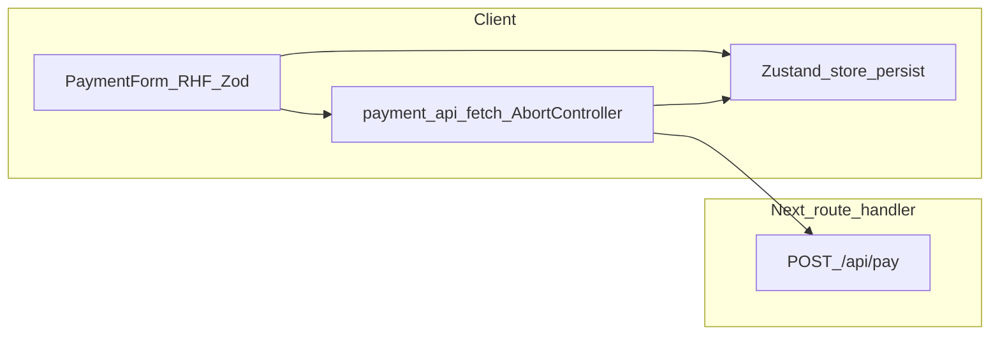

# Payment Gateway — Enterprise-style implementation plan

## PDF requirement traceability ([`/Users/nikhil/Downloads/Kaushik_Resume.pdf`](/Users/nikhil/Downloads/Kaushik_Resume.pdf))

Assignment sections below are **must-pass** at submission; the implementation plan maps each item (bullet format: **PDF → plan**).

- **Next.js App Router + TypeScript** → Stack + files under `app/`.
- **No Stripe / Razorpay / PayPal SDK** → Only `fetch` to the internal route.
- **Mock gateway via Next.js Route Handler** → [`app/api/pay/route.ts`](file:///Users/nikhil/IdeaProjects/React-Training/demo/app/api/pay/route.ts).
- **Form fields: name, number, expiry MM/YY, CVV, amount** → One Zod schema + RHF wiring in the form component.
- **Real-time validation; per-field on type or blur; not only batch on submit** → RHF `mode` / `reValidateMode` (e.g. `onBlur` + change-driven updates); `shouldUseNativeValidation: false`; field-level errors — verify in QA.
- **Submit disabled until fully valid** → `formState.isValid` + schema (extra guard if CVV length depends on card type).
- **Card number spaces every 4 digits** → [`utils/card-format.ts`](file:///Users/nikhil/IdeaProjects/React-Training/demo/utils/card-format.ts) + controlled input.
- **Visa / Mastercard / Amex + badge** → [`utils/card-brand.ts`](file:///Users/nikhil/IdeaProjects/React-Training/demo/utils/card-brand.ts) + Badge.
- **Expiry reject past** → Zod refine + [`utils/expiry.ts`](file:///Users/nikhil/IdeaProjects/React-Training/demo/utils/expiry.ts).
- **CVV 3 or 4 for Amex** → Refine from detected/effective card type.
- **Amount + currency INR & USD (minimum)** → Select + document formatting/locale assumption in README.
- **Live card preview (number, name, expiry)** → [`components/payment/card-preview.tsx`](file:///Users/nikhil/IdeaProjects/React-Training/demo/components/payment/card-preview.tsx).
- **Lifecycle: Idle, Processing, Success, Failed, Timeout** → Zustand + UI.
- **~2s processing after submit** → Hook: minimum display ~2000ms **and** in-flight `pay()` with `AbortSignal` (coordinate both).
- **Distinct result screen per outcome** → [`components/payment/status-screen.tsx`](file:///Users/nikhil/IdeaProjects/React-Training/demo/components/payment/status-screen.tsx): three clearly different layouts (Success vs Failed vs Timeout).
- **`POST /api/pay`** → Route handler only.
- **Server random ~60% / ~25% failed + reason / ~15% respond after 8s** → `Math.random()` on server; failure pool includes **Insufficient funds**; delay branch `await` ~8000ms.
- **Client timeout 6s via AbortController** → [`constants/payment.ts`](file:///Users/nikhil/IdeaProjects/React-Training/demo/constants/payment.ts) `6000` + `fetch(..., { signal })`.
- **Retry on failed or timed-out** → From `StatusScreen` actions.
- **Max 3 attempts; “Attempt N of 3”** → Store counter; block after 3.
- **After 3 failures: retry disabled + final failure message** → Store + UI.
- **Same `crypto.randomUUID()` for all retries** → Create once; send on **every** POST body.
- **`PaymentPayload` includes `transactionId`** → [`types/payment.ts`](file:///Users/nikhil/IdeaProjects/React-Training/demo/types/payment.ts) + API contract.
- **History list: id, amount, status, timestamp** → Transaction model + list.
- **History persists across refresh (`localStorage`)** → Zustand `persist`.
- **Click history row → details** → Dialog/sheet with full fields (+ failure reason when relevant).
- **No `any`; `PaymentPayload`, `Transaction`, `PaymentStatus`, `CardType`** → Central `types/`.
- **Zustand (or RTK) for lifecycle + history + shared UI** → [`stores/payment-store.ts`](file:///Users/nikhil/IdeaProjects/React-Training/demo/stores/payment-store.ts); justify in README.
- **Local form state allowed** → RHF internal state OK.
- **Network vs API errors; friendly messages only** → [`services/payment-api.ts`](file:///Users/nikhil/IdeaProjects/React-Training/demo/services/payment-api.ts) discriminated results.
- **375px and 1280px** → Responsive layout + manual check.
- **Visible labels + `aria-describedby`** → shadcn Field / explicit ids.
- **Focus after payment result** → Ref/`useEffect` target result region.
- **Double-submit; slow network clarity** → Disabled actions while processing + clear status copy / optional skeleton.
- **Required folders: `components/`, `hooks/`, `utils/`, `types/`, `app/api/`** → Keep all five; `stores/`, `services/`, `validation/`, `constants/` are **additional** (brief still satisfied).
- **Separate files for CardInput, StatusScreen, TransactionHistory** → [`card-input.tsx`](file:///Users/nikhil/IdeaProjects/React-Training/demo/components/payment/card-input.tsx), [`status-screen.tsx`](file:///Users/nikhil/IdeaProjects/React-Training/demo/components/payment/status-screen.tsx), [`transaction-history.tsx`](file:///Users/nikhil/IdeaProjects/React-Training/demo/components/payment/transaction-history.tsx) exporting PascalCase components (add `card-preview.tsx` / `payment-form.tsx` as needed; PDF names examples as minimum split).
- **README: setup, assumptions, improvements** → Required by PDF.
- **Meaningful commits (≥1 per section)** → Git process.
- **Public GitHub + deployment link if available** → Submission checklist.

**Explicit gaps closed in this revision (were implicit before):**

- **RHF validation timing** spelled out so “not all errors only on submit” is demonstrably satisfied.
- **Three differentiated result screens** called out (Success vs Failed vs Timeout).
- **Failed route** must return a **reason string** pool including **Insufficient funds**.
- **PaymentPayload** explicitly carries **`transactionId`** on every attempt.
- **Amex** handling: CVV length + typically **15-digit** PAN vs 16 — validation/format max lengths per brand (implementation detail in utils/schema).

## Scope anchor (from assignment PDF)

- **Next.js App Router + TypeScript**; **no** payment SDKs.
- **POST** [`app/api/pay/route.ts`](file:///Users/nikhil/IdeaProjects/React-Training/demo/app/api/pay/route.ts): randomized **Success (~60%)**, **Failed (~25%)** with reason string, **Timeout path (~15%)** — server responds after **~8s**; client uses **`AbortController` at 6s**.
- **UI**: real-time per-field validation (blur/type), submit disabled until valid, card formatting + brand badge, INR/USD + amount, **live card preview**, lifecycle **Idle → Processing → Success | Failed | Timeout**, **retry max 3** with **same transaction id**, **history in store + `localStorage`**, **`crypto.randomUUID()`** idempotency key.
- **Deliverables**: README, meaningful commits, public repo (your process).

## Target architecture

**State machine (store-owned):** `idle` → `processing` → (`success` | `failed` | `timeout`) with explicit transitions; retries increment **attempt** only while reusing **transactionId**.

## Enterprise folder layout (assignment + your coding-principles skill)

Keep **feature boundaries** clear; avoid fat `page.tsx` files ([`app/page.tsx`](file:///Users/nikhil/IdeaProjects/React-Training/demo/app/page.tsx) becomes a thin composer).

Suggested tree:

- [`app/layout.tsx`](file:///Users/nikhil/IdeaProjects/React-Training/demo/app/layout.tsx) — wrap with **Zustand hydration-safe** provider if needed (or rely on `persist` + `skipHydration`), set payment-focused **metadata**, optional skip-link for a11y.
- [`app/page.tsx`](file:///Users/nikhil/IdeaProjects/React-Training/demo/app/page.tsx) — layout regions: form + preview + history (responsive grid).
- [`app/api/pay/route.ts`](file:///Users/nikhil/IdeaProjects/React-Training/demo/app/api/pay/route.ts) — **only** server logic: parse JSON, validate minimal payload shape, random outcome, sleep for timeout branch, return typed JSON + HTTP statuses.
- [`types/payment.ts`](file:///Users/nikhil/IdeaProjects/React-Training/demo/types/payment.ts) — **`PaymentPayload`**, **`Transaction`**, **`PaymentStatus`**, **`CardType`**, API response unions (**no `any`**).
- [`validation/payment-schema.ts`](file:///Users/nikhil/IdeaProjects/React-Training/demo/validation/payment-schema.ts) — **single Zod schema** (DRY: one source for rules + `z.infer` types where appropriate).
- [`utils/card-format.ts`](file:///Users/nikhil/IdeaProjects/React-Training/demo/utils/card-format.ts) / [`utils/card-brand.ts`](file:///Users/nikhil/IdeaProjects/React-Training/demo/utils/card-brand.ts) / [`utils/expiry.ts`](file:///Users/nikhil/IdeaProjects/React-Training/demo/utils/expiry.ts) — pure functions only (formatting, BIN detection, past-expiry rejection).
- [`constants/payment.ts`](file:///Users/nikhil/IdeaProjects/React-Training/demo/constants/payment.ts) — **`CLIENT_TIMEOUT_MS = 6000`**, **`MAX_RETRIES = 3`**, currency metadata, user-facing copy keys (avoid scattered magic numbers).
- [`services/payment-api.ts`](file:///Users/nikhil/IdeaProjects/React-Training/demo/services/payment-api.ts) — **single** `pay(payload, { signal })` returning a **discriminated result**: network error vs HTTP error vs JSON failure vs success — **never** leak raw `Error` objects to UI.
- [`stores/payment-store.ts`](file:///Users/nikhil/IdeaProjects/React-Training/demo/stores/payment-store.ts) — lifecycle, attempts, active transaction id, history list; **`persist`** slice for history (and any fields required to survive refresh per brief).
- [`hooks/use-payment-flow.ts`](file:///Users/nikhil/IdeaProjects/React-Training/demo/hooks/use-payment-flow.ts) (or split if needed) — orchestrates: generate/reuse **transactionId**, debounce/double-submit guard, **~2s processing UX** (timer) **coordinated** with API completion (see sequencing below), maps outcomes to store.
- [`components/payment/`](file:///Users/nikhil/IdeaProjects/React-Training/demo/components/payment/) — mandatory separation per brief:
  - **`card-input.tsx`** — controlled segments + formatting hooks (no JSX business rules beyond wiring).
  - **`card-preview.tsx`** — purely presentational from props / selectors.
  - **`payment-form.tsx`** — React Hook Form + Zod resolver wiring; **shadcn FieldGroup/Field** patterns from [`.agents/skills/shadcn/rules/forms.md`](file:///Users/nikhil/IdeaProjects/React-Training/demo/.agents/skills/shadcn/rules/forms.md).
  - **`status-screen.tsx`** — result states + retry affordances + attempt counter.
  - **`transaction-history.tsx`** — list; click opens detail (dialog/sheet).
- [`components/ui/*`](file:///Users/nikhil/IdeaProjects/React-Training/demo/components/ui/) — shadcn primitives via CLI/MCP (button, input, select, card, badge, alert/dialog/skeleton).

**DRY guardrails (from [`.agents/skills/coding-principles/references/dry.md`](file:///Users/nikhil/IdeaProjects/React-Training/demo/.agents/skills/coding-principles/references/dry.md)):** one schema, one API client, one set of card utilities, one mapping from API/network failures to **friendly** strings; duplicate-looking UI only when business meaning differs.

## UX / flow specifics (seamless + enterprise-grade)

- **Processing UX:** Brief asks **~2s processing** presentation **and** randomized backend timing. Implement orchestration in the hook: enter `processing`, await **both** (a) `minDisplayMs ~ 2000` and (b) in-flight `pay()` that respects **`AbortSignal`**; whichever finishes last before timeout determines transition. On **abort at 6s**, transition to **`timeout`**, enable retry per rules.
- **Double submission:** disable submit + ignore duplicate clicks while `processing`; guard in store/actions too.
- **Retries:** single **`transactionId`** across attempts; **`attempt`** increments only on failure/timeout paths; cap at **3** then terminal failure UI.
- **Accessibility:** visible labels; **`aria-invalid`**, **`aria-describedby`** to error ids; announce major status changes via **`aria-live`** region on result; **move focus** to result heading/container on terminal transitions (Idle → result).
- **Responsive:** single column on **375px**, split layout on **1280px** (preview + form).
- **Visual direction:** apply [`.agents/skills/frontend-design/SKILL.md`](file:///Users/nikhil/IdeaProjects/React-Training/demo/.agents/skills/frontend-design/SKILL.md) to the **checkout aesthetic** (distinct typography/color motion choices) while staying WCAG-minded (contrast, motion prefers-reduced-motion).

## Route handler behavior (Next conventions)

Follow [`.agents/skills/next-best-practices/route-handlers.md`](file:///Users/nikhil/IdeaProjects/React-Training/demo/.agents/skills/next-best-practices/route-handlers.md): **`POST` only**, `await request.json()`, validate body, implement random branches with `Math.random()`, use `await new Promise(r => setTimeout(r, ms))` for delay branches, return **`Response.json`** with stable JSON shapes the client types.

## shadcn MCP / components

Use your configured MCP ([shadcn MCP docs](https://ui.shadcn.com/docs/mcp.md)) to add only what you need: **Input**, **Select**, **Button**, **Card**, **Badge**, **Alert**, **Dialog** (or **Sheet**), optional **Skeleton** for processing. Compose with **FieldGroup + Field** per your skill rules.

## Verification checklist (before submission)

- **Functional:** formatting/BIN/CVV rules/INR+USD, all states, 6s abort, retries, persisted history, idempotent id on retries.
- **`pnpm/npm run build`** passes; **`eslint`** clean for touched files.
- **Manual passes:** mobile/desktop layouts; keyboard-only submit + retry; refresh preserves history.

## README / commits (assignment)

- README: setup, assumptions (e.g., processing timer semantics), known limitations, **what you’d improve next**.
- Commits: align to brief sections (form, API, store, history, a11y polish).
